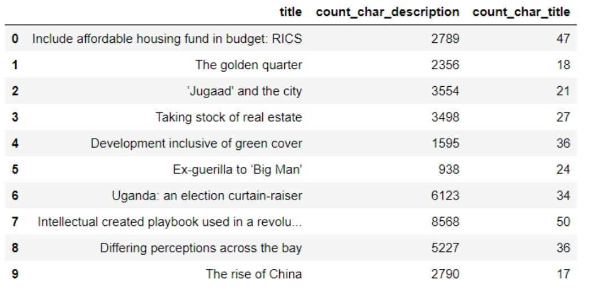
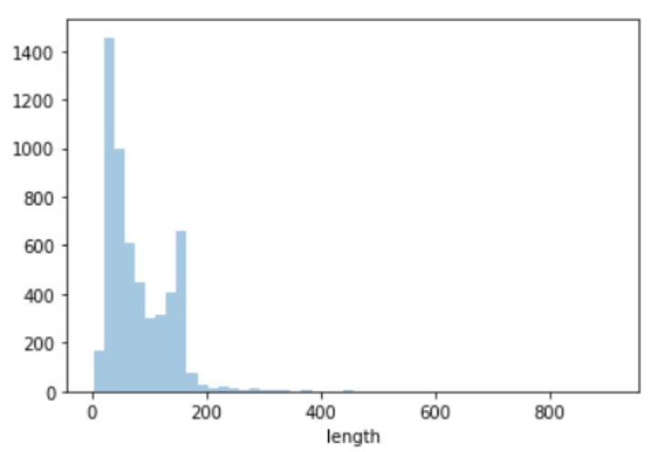
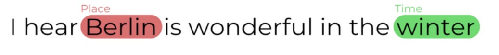
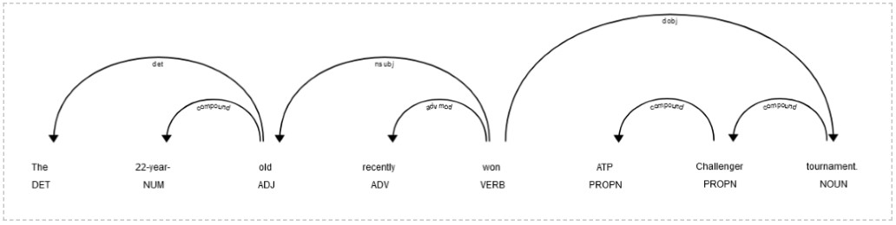
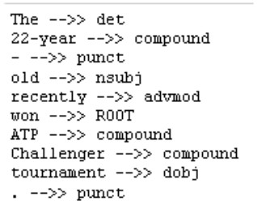
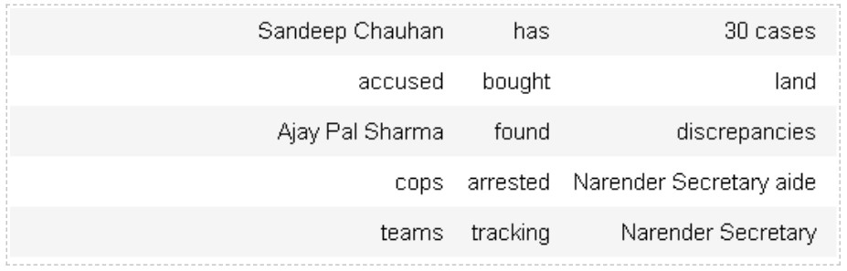
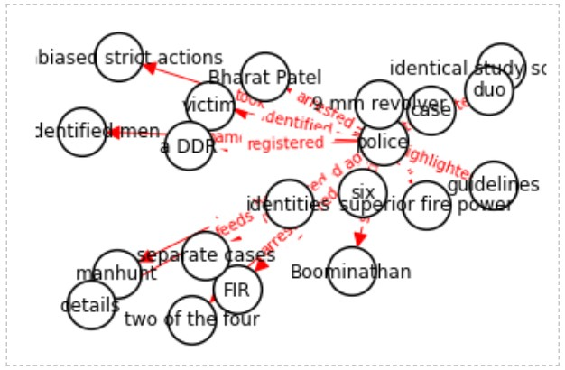
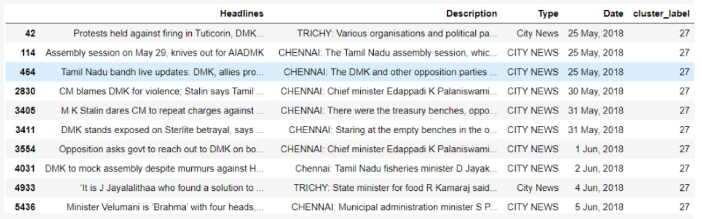
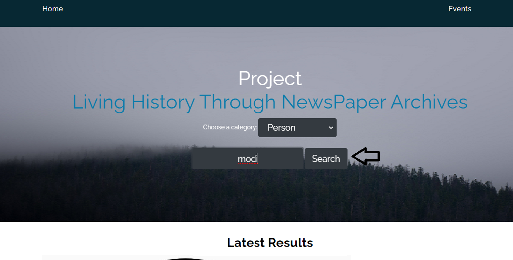
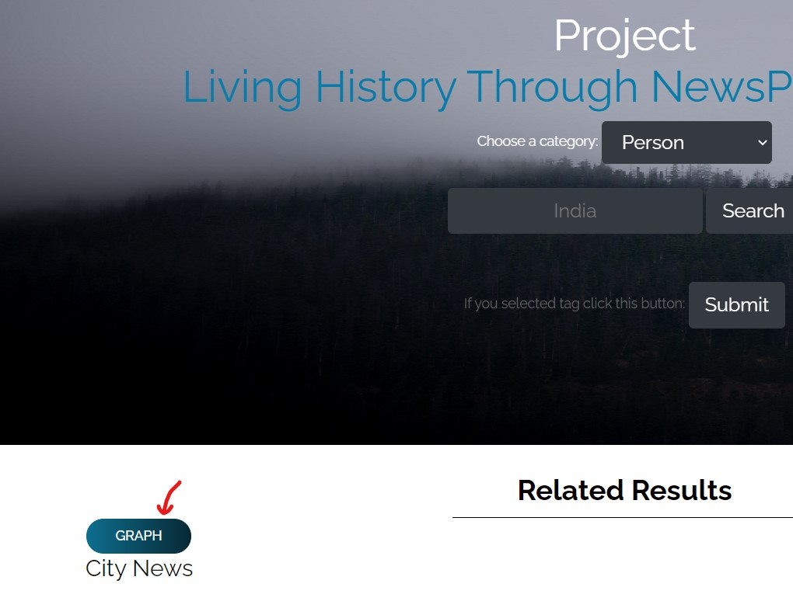

- - -

<div align='center'> <h1>Living History through Newspaper Archives</h1></div>

- - -

## Sections
* [Business Understanding](#business-understanding)
* [Business Description](#business-description)
	* [Terms used](#terms-used)
	* [Objectives of the Project](#objectives-of-the-project)
* [Data Preparation](#data-preparation)
    * [Data Collection](#data-collection)
    * [Data Preprocessing](#data-preprocessing)
    * [Data Cleaning](#data-cleaning)
    * [Exploratory Data Analysis](#exploratory-data-analysis)
* [Modelling](#modelling)
    * [Vectorization of Documents](#vectorization-of-documents)
    * [Dimensionality Reduction](#dimensionality-reduction)
    * [Classification](#classification)
    * [Name Entity Recognition](#name-entity-recognition)
    * [Relation Extraction](#relation-extraction) 
    * [Knowledge Graph](#knowledge-graph)
    * [Clustering](#clustering)
* [Deployment](#deployment)
    * [Flask](#flask)
    * [NetworkX](#networkx)
    * [Layout](#layout)
* [Future Scope](#future-scope)
* [References](#references)


- - - 
- - - 
 
<div align='center'> <h2>Business Understanding</h2></div>

> News Archives contain the recent history of the world we live in. New generations are unlikely to understand issues and events that took place prior to their birth. This project aims to use Natural Language Processing to analyse News archives and visualise them in interesting and novel ways that allows people to explore these events without having to search and assess large numbers of sources.

- - -
- - - 
 
<div align='center'> <h2>Business Description</h2></div>

### Terms used

- BeautifulSoup
- Count Vectorizer
- TF-IDF Vectorizer
- Name Entity Recognition
- Knowledge Graphs
- Flask
- NetworkX

- - -
### Objectives of the Project

- To use the enormous data present on web and use it in a way to look through the history.

- To find the various actors, actions and the events present in the articles and associate them to other entities through relations.

- To test the traditional Rule Based approach for Information Extraction on unlabeled and huge amounts of data. 

- - -
- - - 
 
<div align='center'> <h2>Data Preparation</h2></div>


Data Preparation is a very import step while doing any data science project. Good data preparation allows for efficient analysis, limits errors and inaccuracies that can occur to data during processing, and makes all processed data more accessible to users. It’s also gotten easier with new tools that enable any user to cleanse and qualify data on their own. 76% of data scientists say that data preparation is the worst part of their job, but the efficient, accurate business decisions can only be made with clean data.


**Data Preparation helps us in:**

- **Fix errors quickly** 
  
  Data preparation helps catch errors before processing. After data has been removed from its original source, these errors become more difficult to understand and correct.
	
- **Produce top-quality data**
  
  Cleaning and reformatting datasets ensures that all data used in analysis will be high quality.
	
- **Make better business decisions**
  
  Higher quality data that can be processed and analyzed more quickly and efficiently leads to more timely, efficient and high-quality business decisions.
  
- **Superior scalability** 
  
  Cloud data preparation can grow at the pace of the business. Enterprise don’t have to worry about the underlying infrastructure or try to anticipate their evolutions.
- - -

### Data Collection

Primarily we focused on historical data of India, for past twenty years.

> Our main source of data were:
- Times of India
- The Hindu

Data was collected with the help of python libraries such as BeautifulSoup and requests. Format of the data was: news type, news description and the date of publication.


- - -

### Data Preprocessing

Data in the Real Word is Dirty

- Noisy: Containing different type of errors and outliers
- Inconsistent: Containing discrepancies 
- Incomplete: Lacking attribute values, lacking certain attributes of interest  or containing only aggregate data


- - -

### Data Cleaning

We need an efficient format of our data before converting it into mathematical form. To convert raw data into required format we perform some steps:

> Data Cleaning:
- Noise Cleaning
- Stop word removal
- Converting all letters into lowercase
- Tokenization
- Stemming or Lemmatization


- - -

### Exploratory Data Analysis

EDA is a set of techniques to display data in such a way that interesting features will become apparent.

EDA helps us to :

- Learn more about individual features and relationships among various features

- Extract insights and discover hidden patterns of data

- Discovers outliers and anomalies in data

Before we start exploring the data, we must first load in the data. You may be familiar with this, but the Pandas library actually makes this a simple task. And then, we use the read_csv() function for loading in the data. We pass into this function the URL in which the data can be found. 

> Describe the data 

One of the most elementary steps to do this is by getting a basic description of your data. A basic description of your data is indeed a very broad term: you can interpret it as a quick and dirty way to get some information on your data, as a way of getting some simple, easy-to-understand information on your data, to get a basic feel for your data, etc 

To begin, we can use the describe() function to obtain various summary statistics that exclude NaN values. We can refer back to our digits data and understand it a bit better.



> Basic Visualization 

Data visualization can help with identifying patterns in the data. The Python libraries Seaborn and Matplotlib are easy and quick ways to do this. 

There are a couple basic visualizations we can do. The first is displaying the length of all the dataset instances. To do this, we must first label the columns with their appropriate titles and add a column to the dataset that contains the length. 


- - -

- - - 
 
<div align='center'> <h2>Modelling</h2></div>


### Vectorization of Documents

When we are dealing with text data we need to vectorize it and convert it into the numerical format because machine learning algorithms takes input in the form of numerical format.


There are various techniques which are used for this, but we went with the basic techniques:
- Count Vectorizer
- Tfidf Vectorizer

Tf-idf is known as Term Frequency Inverse Document Frequency. It is obtained by the multiplication of 2 matrices.


- - -

### Dimensionality Reduction

Dimensionality reduction is an important step to perform while dealing with text problems. As in these kind of problems the number of input variables are equal to the total number of unique words present in the corpus. As a result after performing the vectorization we get a huge sparse matrix, which makes modelling process difficult. So we perform LSA, it is basically performing Singular Value Decomposition on Document Term Matrix. In which rows represent words and columns represent documents. SVD decomposes this matrix into three different matrices. So SVD gives us vectors for every document and term in our data.

- - -

### Classification

Text Classification also known as text tagging or text categorization is the process of categorizing text into organized groups. By using Natural Language Processing text classifiers can automatically analyze the text and then assign them to pre-defined class or category.

We performed text classification because we were not having sufficient labelled data(News type). So we made a classification model with our labelled data and Support Vector Machines, with the help of it we were able to assign classes to our unlabelled data. There were 8 classes: City News, India News, World News, Business News, Entertainment, Sports News, Education and lifestyle.

- - -

### Name Entity Recognition


Named entity recognition (NER) — sometimes referred to as entity chunking, extraction, or identification — is the task of identifying and categorizing key information (entities) in text. An entity can be any word or series of words that consistently refers to the same thing. Every detected entity is classified into a predetermined category. 
Used this model as first step towards information extraction that seeks to locate and classify named entities in the text into predefined categories  such as the name of person, location, organisation etc. This model helped us to answering questions like :

 About which the news article is ?
 
 At which location event occured ?
 
##### How NER works 

At the heart of any NER model is a two step process: 

- Detect a named entity 

- Categorize the entity

> Here's an example:



Various categories in NER are as follows: 

- Person: E.g., Elvis Presley, Audrey Hepburn, David Beckham 

- Organization: E.g., Google, Mastercard, University of Oxford 

- Time: E.g., 2006, 16:34, 2am 

- Location: E.g., Trafalgar Square, MoMA, Machu Picchu 

- Work of art: E.g., Hamlet, Guernica, Exile on Main St. 

Some notable NER use cases include: 

- Human resources: 

Speed up the hiring process by summarizing applicants’ CVs; improve internal workflows by categorizing employee complaints and questions 

- Customer support: 

Improve response times by categorizing user requests, complaints and questions and filtering by priority keywords 

- Search and recommendation engines:

Improve the speed and relevance of search results and recommendations by summarizing descriptive text, reviews, and discussions 

- Content classification: 

Surface content more easily and gain insights into trends by identifying the subjects and themes of blog posts and news articles 

> Technology Used for N.E.R: 

SpaCy is a library for advanced Natural Language Processing in Python and Cython. It's built on the very latest research, and was designed from day one to be used in real products. spaCy comes with pretrained statistical models and word vectors, and currently supports tokenization for 60+ languages. It features state-of-the-art speed, convolutional neural network models for tagging, parsing and named entity recognition and easy deep learning integration. 


- - -

### Relation Extraction

Relation Extraction is the task of extracting semantic relationships from text, which usually occur between two or more entities. Extracted relationships usually occur between two or more entities of a certain type (e.g. Person, Organisation, Location) and fall into a number of semantic categories (e.g. married to, employed by, lives in). 

Eg. Consider the text :- “Jack killed a dog” 

Here jack is subject and dog is object and killed is relation between them. 

Various Methods for Relation Extraction are: 

a.  Supervised  ::  Let’s say we have a sentence S. It has two entities E1 and E2. Now, the supervised machine learning model has to detect whether there is any relation (R) between E1 and E2. So, in a supervised 

b. Semi supervised  :: When we don’t have enough labeled data, we can use a set of seed examples (triples) to formulate high-precision patterns that can be used to extract more relations from the text 

c.  Rule Based :: We define a set of rules for the syntax and other grammatical properties of natural language and then use these rules to extract information from text 

We have implemented Rule Based Relation extraction in our project. For this purpose we have used Dependency Parsing in Spacy 

> Below diagram shows the dependency tree of the sentence “The 22 year old recently won ATP challenger tournament.”: 





We have built following rule based on the dependency graph: 

```
“subject = nsubj + compunds ” 

“Relation = root” 

“object = dobj +compounds”  
```

> Here is the snapshot of the relations we have collected, we have stored these relations in a csv file and will use this file to plot knowledge graphs.



- - -

### Knowledge Graph

The knowledge graph represents a collection of interlinked descriptions of entities, may it be objects, events or concepts. Knowledge graphs put data in context via linking and semantic metadata and this way provide a framework for data integration, unification, analytics and sharing. 

We have used Networkx  Library for plotting our graphs: 

NetworkX is a Python package for the creation, manipulation, and study of the structure, dynamics, and functions of complex networks.  

> Here is the Graph for the entity “police”:




- - -

### Clustering

Clustering is the task of dividing the population or data points into a number of groups such that data points in the same groups are more similar to other data points in the same group than those in other groups. In simple words, the aim is to segregate groups with similar traits and assign them into clusters. 

Let’s understand this with an example. Suppose, you are the head of a rental store and wish to understand preferences of your costumers to scale up your business. Is it possible for you to look at details of each costumer and devise a unique business strategy for each one of them? Definitely not. But, what you can do is to cluster all of your costumers into say 10 groups based on their purchasing habits and use a separate strategy for costumers in each of these 10 groups. And this is what we call clustering 

In our project we have used k means clustering.Lets understand k means clustering in detail. 

> K means: 

K-Means Clustering is a simple yet powerful algorithm in data science 

There are a plethora of real-world applications of K-Means Clustering 

Clustering helps us understand our data in a unique way – by grouping things together into – you guessed it – clusters. 

K-means is a centroid-based algorithm, or a distance-based algorithm, where we calculate the distances to assign a point to a cluster. In K-Means, each cluster is associated with a centroid. The main objective of the K-Means algorithm is to minimize the sum of distances between the points and their respective cluster centroid. 

We have these 8 points and we want to apply k-means to create clusters for these points. Here’s how we can do it. 

Step 1: Choose the number of clusters k 

Step 2: Select k random points from the data as centroids 

Step 3: Assign all the points to the closest cluster centroid 

Step 4: Recompute the centroids of newly formed clusters 

Step 5: Repeat steps 3 and 4 

Stopping Criteria for K-Means Clustering 

There are essentially three stopping criteria that can be adopted to stop the K-means algorithm: 

Centroids of newly formed clusters do not change 

Points remain in the same cluster 

Maximum number of iterations are reached 

We can stop the algorithm if the centroids of newly formed clusters are not changing. Even after multiple iterations, if we are getting the same centroids for all the clusters, we can say that the algorithm is not learning any new pattern and it is a sign to stop the training. 

> Implementation of k means: 
 
 ```python
from sklearn.cluster import KMeans 

kmeans = KMeans(init="random",n_clusters=3,n_init=10,max_iter=300,random_state=42) 

kmeans.fit(X) 
```


- - -
- - - 
 
<div align='center'> <h2>Deployment</h2></div>


### Flask

To leverage a web API for the model, we made use of [Flask](https://flask.palletsprojects.com/en/1.1.x/) framework. It provides functionality for building web applications, including managing HTTP requests and rendering templates.

[**WSGI**](https://en.wikipedia.org/wiki/Web_Server_Gateway_Interface)

Web Server Gateway Interface (WSGI) has been adopted as a standard for Python web application development. WSGI is a specification for a universal interface between the web server and the web applications.

[**Werkzeug**](https://palletsprojects.com/p/werkzeug/)

It is a WSGI toolkit, which implements requests, response objects, and other utility functions. This enables building a web framework on top of it. The Flask framework uses Werkzeug as one of its bases.

[**Jinja2**](https://jinja.palletsprojects.com/en/2.11.x/)

Jinja2 is a popular templating engine for Python. A web templating system combines a template with a certain data source to render dynamic web pages.

We binded two URLs with route() decorators to the backend functions, used render_template() function to render the HTML page on the basis of Jinja2 engine and query was sent back as a request object.

> Calling the two functions, first one puts a html page for search and the second one is used to return the query results after query is posted from the first:

```python		
	@app.route('/')			
	def firstPage():		
``` 
	
```python
	@app.route('/', methods=['POST'])
	def Input():
```

> Request object usage, to get the posted query:

```python
	if request.form['submitButton']=='Search':
		query = request.form['query']
```
	
> The dictionary is returned from the first page is then rendered into second page by parsing:

```
	
		{{key}}
		
			{{item.date}}
			{{item.headlines}}
			{{item.description}}
			
				{{ite}}
			
		
	
```

- - -

### NetworkX

Python’s [**NetworkX**](https://networkx.org/) package is used for the creation, study of the structure and functions of complex networks.
We made its use to represent the entities and various relations in between them. 
Entities generated from NER were feeded as nodes to the networkX graph, while the relations represented the edges for the network.

This graph data is then feeded to matplotlib's pyplot sub-module, to  produce a visual output for the same.

> At first, we get edges list using:

```python
	k = nx.from_pandas_edgelist(#passedData, #sourceNodeVariable, #targetNodeVariable, #Graph class)
```

> Depth first search from source:

```python
	nx.dfs_successors(#k, #query)
```

> To set the attributes for the graph:

```python
	nx.draw_networkx(#variousParamenters)
```	
	
- - -

### Layout

flsk.py includes the main running front end Flask server program, with back-end search program in pyModules directory.

The web output is as following:

> Search for the keyword



> Get the news history


> Click on *GRAPH* button to get a knowledge graph related to query/tag



> An overlay graph for the searched query/tag


- - -
- - - 
 
<div align='center'> <h2>Future Scope</h2></div>

- Better Classification algorithm:

We chose SVM because generally they are very fast to train. Also SVMs effectively use only a subset of the whole training data because these reliably identify the decision boundary on basis of sole support vectors. Thus, the number of observations required to train SVM isn't high (we didn't had enough data to effectively train a NN and that too needs a good rig to work). So, a hybrid approach might be better than chosing specific one. <sup>[9](#9)</sup>

- Open or hybrid relation extraction:

Traditional Information Extraction approaches limit the scope to a particular domain and need a lot of labor to manually label the data. Using OIE(Open Information Extraction) or a hybrid approach of the combination of these produce better results. <sup>[10](#10)</sup>

- Model-based Clustering algorithm

In model-based clustering, the data is considered to be originating from a mixture of density, whereas the present approach(k-means) is a heuristic approach. Unlike k-means the former clustering used soft assignment, i.e., each data point has a probability of belonging to each cluster. Also, we don't have to specify the optimal number of clusters for the data. 

- Getting a better UI for User:

Flutter for low-computation device deployment
	
Djnago or other complex frameworks for machines

- More interactive and knowledgeable visualizations:

Using D3.js for graphical data

- - -
- - - 
 
<div align='center'> <h2>References</h2></div>

1: https://nlp.stanford.edu/software/dependencies_manual.pdf

2: https://towardsdatascience.com/all-the-news-17fa34b52b9d

3: https://github.com/dipanjanS/text-analytics-with-python

4: https://www.aclweb.org/anthology/D19-1650.pdf

5: https://www.aclweb.org/anthology/2020.acl-main.139.pdf

6: https://flask.palletsprojects.com/en/1.1.x/

7: https://github.com/networkx/networkx/ 

8: https://spacy.io/usage/linguistic-features


##### 9: 

- [A HYBRID LEARNING ALGORITHM FOR TEXT CLASSIFICATION](https://arxiv.org/ftp/arxiv/papers/1009/1009.4574.pdf)

- P. Nedungadi, H. Harikumar and M. Ramesh, "A high performance hybrid algorithm for text classification," The Fifth International Conference on the Applications of Digital Information and Web Technologies (ICADIWT 2014), Bangalore, 2014, pp. 118-123, doi: 10.1109/ICADIWT.2014.6814691.

##### 10:  [The Tradeoffs Between Open and Traditional Relation Extraction](http://turing.cs.washington.edu/papers/acl08.pdf)

- - -
- - - 

